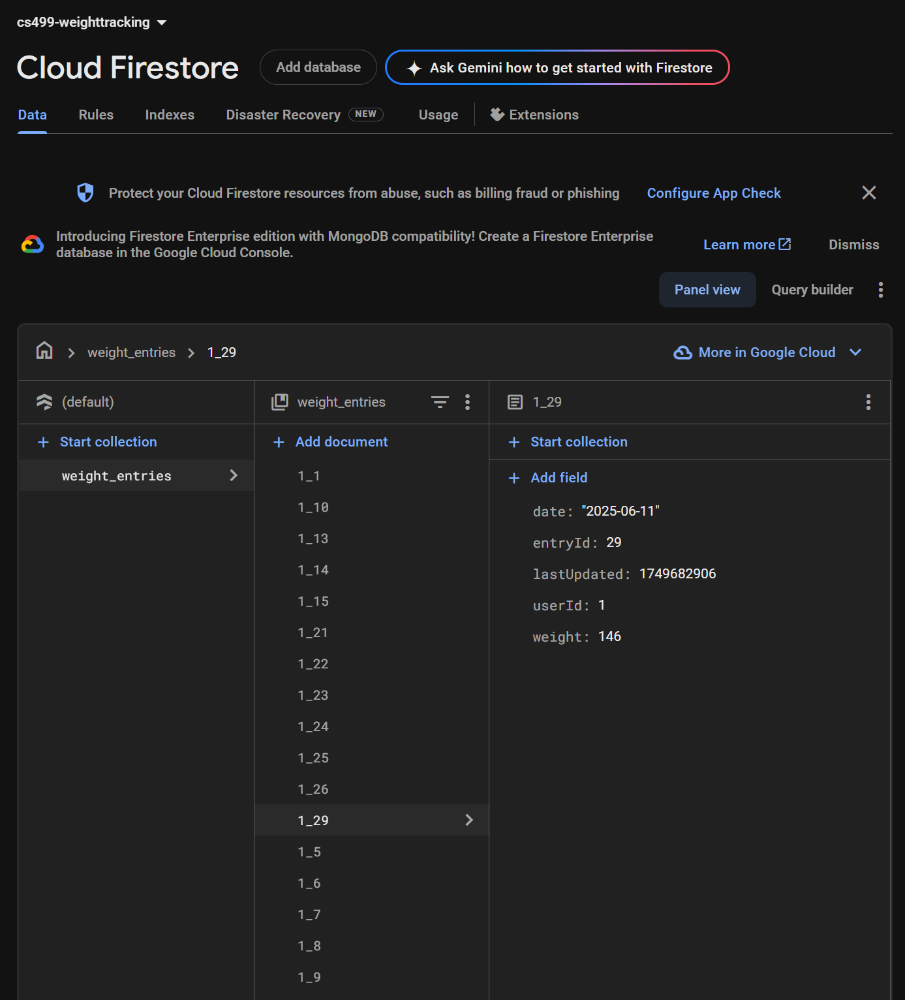

---
# Professional Self-Assessment

Hello! My name is Erin and this is my ePortfolio for CS 499, the Computer Science Capstone course at Southern New Hampshire University. This course gave me the opportunity to take a project I had previously developed and enhance it using the skills and knowledge I’ve gained throughout the Computer Science program.

As I’ve worked toward my Bachelor of Science degree in Computer Science with a concentration in Data Analysis, I’ve built a solid foundation in both core computer science concepts and practical, hands-on experience. I’ve developed skills in programming languages such as C++, Java, Python, SQL, and R, and I’ve applied object-oriented programming principles across multiple projects. I also gained a strong understanding of agile development practices and how to adapt them to a variety of software development scenarios.

For my capstone, I chose to enhance a mobile application originally created in my Mobile Architecture and Programming course. I applied enhancements across all three required categories: Software Design and Engineering, Algorithms and Data Structures, and Databases. 

This project not only allowed me to demonstrate the technical skills I’ve developed but also challenged me to think critically about design decisions, user experience, and long-term maintainability. I focused on applying real-world development practices by refactoring code to improve structure and readability, implementing new features that added real value to the user, and integrating third-party libraries and cloud services to extend functionality. Each enhancement aligned with one of the program outcomes and encouraged me to apply what I’ve learned in a cohesive and thoughtful way.

You'll find a summary of the narratives for each enhancement category in the sections below. Each narrative describes the work completed, some of the challenges I ran into, and how the updates reflect what I’ve learned and how my skills have grown. I’ve also included links to the original PDF submissions in the GitHub repository for each category if you’d like to take a closer look.

<a href="https://github.com/eekiesel/CS499/tree/main/Milestone%20Narratives" target="_blank">
  View all Milestone Narratives on GitHub
</a>

##  Course Outcomes
I believe the work I’ve done for this capstone project shows that I’ve met all of the course outcomes and reflects the knowledge and skills I’ve built throughout the Computer Science program. Below are some examples of how I've met each course outcome:

 **Employ strategies for building collaborative environments that enable diverse audiences to support organizational decision making in the field of computer science**

I’ve practiced creating clean, readable code and writing clear documentation, which is important when working on a team in a collaborative environment. I’ve used GitHub to share code and organize work, which supports future collaboration. I’ve also taken measures to consider the needs of my users and made decisions that support those needs.

**Design, develop, and deliver professional-quality oral, written, and visual communications that are coherent, technically sound, and appropriately adapted to specific audiences and contexts**

This ePortfolio, along with the written milestone reports and accompanying visuals, demonstrate my ability to communicate technical work in a clear and professional way. I focused on writing explanations that would make sense to both technical and non-technical audiences, and the screenshots provide visual context to highlight the improvements made to the application’s design, usability, and functionality.

**Design and evaluate computing solutions that solve a given problem using algorithmic principles and computer science practices and standards appropriate to its solution, while managing the trade-offs involved in design choices**

To improve my app’s ability to track and analyze user progress, I designed custom logic using helper classes like WeightTrendAnalyzer and a utility class WeightHeapUtil to calculate things like streaks and trends. These features required me to think through how to structure the algorithms in a way that was both efficient and easy to maintain. I also used timestamps to resolve data conflicts between local and cloud storage, which reflects my ability to make design trade-offs between complexity, performance, and usability.

**Demonstrate an ability to use well-founded and innovative techniques, skills, and tools in computing practices for the purpose of implementing computer solutions that deliver value and accomplish industry-specific goals**

Throughout this project, I incorporated tools like MPAndroidChart to create a visual dashboard and Firebase to enable real-time data syncing across devices. I also redesigned the interface using Material Design 3 components, which helped make the app cleaner, easier to use, and more consistent with current mobile design standards. In addition to those visual improvements, I added two-way synchronization between Firebase and SQLite, as well as a CSV export feature, allowing users to save or transfer their data. These enhancements show my ability to apply practical, real-world tools and techniques that provide value to users.

**Develop a security mindset that anticipates adversarial exploits in software architecture and designs to expose potential vulnerabilities, mitigate design flaws, and ensure privacy and enhanced security of data and resources**

Although this app doesn’t manage highly sensitive data, I still approached the design with security in mind. I implemented input validation, ensured that session data is handled securely, and avoided hardcoded credentials. I also thought about what would be required to make the app production-ready in the future, like adding authentication and data encryption. Even though those weren’t fully implemented due to time constraints, I’ve developed a security-aware mindset and understand what steps would be needed to protect user data in a real-world deployment.

---

# Artifact Selection

The capstone project for the Computer Science program at SNHU was required to demonstrate my skills in the three key categories: Software Design and Engineering, Algorithms and Data Structure, and Databases. I chose to select one artifact that I could work with to show my skills in all three categories. I chose to work with the weight tracking Android application that I originally developed in CS 360: Mobile Architecture in Programming that I took in Fall 2024. This was a very basic weight tracking application developed in Android Studio. It allowed users to log in, track their weight, set a goal weight, and edit and delete entries using a local SQLite database. 

The enhancements of my weight tracking application were done in stages, first tackling Software Design and Engineering, then Algorithms and Data Structure, and then Databases. Below you'll find narratives for these enhancements as they were developed.

---

# Code Review

Below is a link to a video of a code review of the original application as it was at the beginning of the class with planned enhancements. You can see a walkthrough of the app early in the video and it's clear how basic the functionality of the application is.

<iframe width="560" height="315"
        src="https://www.youtube.com/embed/giIBgWjw55k"
        frameborder="0"
        allow="accelerometer; autoplay; clipboard-write; encrypted-media; gyroscope; picture-in-picture"
        allowfullscreen>
</iframe>

---

# Software Design and Engineering

This project was selected because it had a solid foundation but a lot of room for improvement that would allow me to showcase improvements in software design and engineering. I focused on improving both the structure and maintainability of the application, along with significantly enhancing the user interface to follow modern mobile design standards.

From a design perspective, one of the most important changes I made was restructuring the app’s logic by introducing helper classes such as GoalManager and NotificationHelper. This modular approach allowed me to isolate key responsibilities and improve code organization, readability, and reusability. Instead of having all logic embedded directly in activities, responsibilities like goal tracking and SMS notifications are now handled by dedicated components that follow single-responsibility principles. The weight entry list was improved with better formatting, scrollability, and updated visual indicators for edit/delete actions, enhancing both usability and aesthetics.

While Jetpack Navigation was originally part of my proposal, I was unsuccessful in implementing it for this project and I chose to defer this feature in order to focus on polishing the app’s core structure and user experience for this milestone. I also laid the groundwork for profile management by using SharedPreferences to persist the current user ID across sessions. 

## Project Screenshots
The completed updates help make the app closer to what you’d expect from a real-world mobile application in terms of usability and appearance. Below are screenshots comparing the original home screen with the redesigned version completed for this milestone:

  

    
    
Original Homepage

  

  

    
    
Updated Homepage

  

  

The updated design is cleaner and more modern, with improved spacing, typography, and layout. A weight progress chart has been added to provide users with a quick visual summary of their trends. The entry list now uses icons for editing and deleting entries and is scrollable for easier access to past data. One improvement still in progress is updating the chart’s x-axis to display dates rather than entry numbers.

## Reflection
Working on these enhancements helped me see how much impact thoughtful design has on an application. It’s not just about getting the app to run without errors, it’s about creating a product that feels polished, is easy to use, and aligns with user expectations. Once I started using Material Design components and refining the layout, the app began to look and feel more professional and user-friendly.

Restructuring parts of the codebase also had a big impact. Breaking logic into dedicated helper classes like GoalManager and NotificationHelper made the codebase more modular and easier to manage. Ideally, I would have developed the app in this fashion from the start but doing it after the fact meant that I had to take extra steps for testing to ensure that the application continued to function as expected. 

One challenge that I faced was caused by the fact that it had been about six months since I took the class that I had originally developed this application in. While some parts of my code were well documented and allowed me to quickly refresh myself on what was going on, some others weren't so well documented, so just going over my code and understanding it sometimes took some extra time. This really highlighted the importance of consistent commenting throughout my code so that I (or someone else looking at it) could quickly understand what each section was meant to accomplish. 

While I began the process of implementing Jetpack Navigation to modernize the app’s navigation flow, I encountered several development challenges along the way. There were some integration errors and refactoring problems that ended up being more time-consuming than I expected, and with the tight schedule of the eight-week course, I wasn’t able to get it fully working without errors. Even though I didn’t finish that part, I learned a lot about how Jetpack Navigation works and how it can help make an app more organized and easier to maintain. If I were building an app like this again, I’d definitely plan to use it from the beginning—it would make things cleaner and more scalable in the long run.

Despite the challenges, I feel the enhancements and updates I was able to complete significantly improve  both the design and structure of the application and bring it much closer to what you would expect from a production-quality mobile application. 

---

# Algorithms and Data Structures

My application at the end of CS 360 had limited functionality for the user, so I felt there were opportunities to enhance the application in the area of Algorithms and Data Structure to provide a more meaningful experience to the user. At the start of this capstone course, the application simply displayed a list of weight entries to the user; they couldn’t draw any meaningful conclusions from the data other than receiving a notification when they reached their goal.

To enhance the user experience, I added custom maximum and minimum heap classes to track the highest and lowest weights efficiently. I also created a WeightTrendAnalyzer class that uses logic to detect the longest streak of consecutive days a user logs their weight, the longest streak of days their weight decreased, and their longest weight plateau where they saw very little change. So now instead of only seeing a list of entries, the user sees a visual graph of their weight progress as well as some quick stats regarding their minimum and maximum weight, as well as some streak data. There is evidence that streaks encourage users to engage more with apps (Anizoba, 2025), so including this as an enhancement could encourage the user to meet their weight goals and use the app more often.

## Project Screenshots
Below you can see the progress of the development of the application. The first image is at the end of CS 360, very basic, just a list of entries with dates. The second image is at the end of the Software Design and Engineering Milestone; overall, a better, more professional looking app with some meaningful information with the addition of a chart. Then the third image is the app currently, I’ve formatted the chart better with more meaningful date labels on the x-axis, it’s zoomable and scrollable, and has a clear goal marker on it. There are also some quick and meaningful stats for the user right below the chart and then the scrollable list is below that. I also formatted the dates to be in the format that most Americans are used to (month/date/year).

      
      
CS 360 Homepage

    

      
      
Design & Engineering Milestone

    

      
      
Algorithms & Data Structures Milestone

    

## Reflection
Enhancing and modifying this artifact  for the Algorithms and Data Structures portion of the capstone project taught me a lot about how to take a simple app and start adding more meaningful features behind the scenes. Figuring out how to calculate trends like streaks and plateaus pushed me to think more carefully about how to structure the data and how to compare dates and weights efficiently. 

One challenge I ran into was formatting and displaying the results clearly, especially when dealing with date ranges and keeping the UI consistent. Another was making sure I didn’t break anything while adding logic that handled edge cases, like entries with the same weight or missing days. 

I also realized that I have a habit of writing a lot of logic directly in HomeActivity, even when it would probably be cleaner and easier to manage in its own class. I’m definitely still learning how to better organize my code. Working through these improvements helped me get better at writing code that’s not just functional, but also more maintainable and user-friendly.

---

# Databases

Working on this application for the Databases category of the capstone project allowed me to work with both a local database and a cloud-based one. The original application as designed for CS 360 stored all data locally using a SQLite database. To enhance the application, I added a Cloud Firestore database to allow for cloud syncing as well as the ability for a user to export their weight entry data to a CSV file. 

I wrote the logic to sync entries between SQLite and Firestore, which included handling conflicts when the same entry existed in both places. To solve this, I used timestamps to decide which version to keep. I also built a way to track which entries needed to be synced and marked them as synced after uploading. These updates show I can build useful, real-world database features. The CSV export is an additional feature that allows users to save or share their weight history outside of the app. 

## Project Screenshots
Below you can see a screenshot of the weight entries from my test user’s account in the Firestore database:

I tested to make sure that when a new entry is added, it is included in both databases, as well as ensuring any edits or deletions are reflected in both the Firestore and SQLite databases. 

Here you can see a slightly updated home page with an additional button along the bottom to allow a user to export their data as a CSV file: 

And here’s a look at the CSV file created in the Download folder of the virtual device used for testing:

## Reflection
Adding Firebase was a bit of a struggle for me. It’s not something that I’ve had experience with in any of my classes, other than just reading about it. Once I felt like I had my code implemented for it to work, my application just stopped loading when I was testing it. It wasn’t crashing, it was just freezing when I was trying to load it. This caused me to be stuck for quite a while, making a lot of changes and getting nowhere. Eventually I sought help from a friend of mine that has experience with developing apps and he suggested clearing the data from the emulator, and suddenly my application was loading. It was frustrating to realize that the solution to my problem was something simple that I just hadn’t considered. But the experience really illustrates the importance of talking through problems with others and not being afraid to seek guidance from someone more experienced. Overall, this enhancement helped me get more comfortable working with different types of databases. 

---

## References
Anizoba, P. (2025, April 14). Designing for User Retention: The Psychology Behind Streaks. Retrieved from Medium: https://medium.com/design-bootcamp/designing-for-user-retention-the-psychology-behind-streaks-cf0fd84b8ff9

